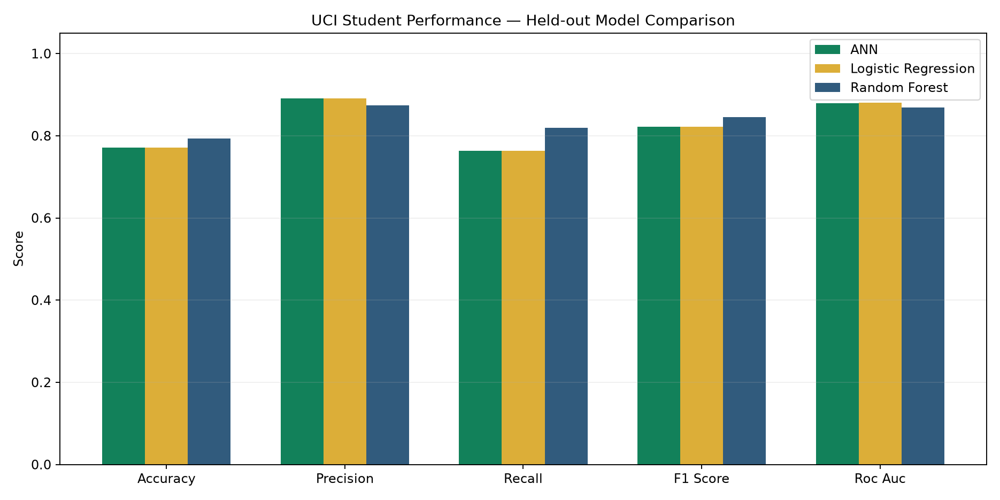
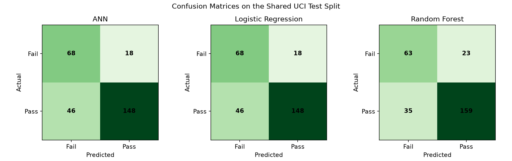
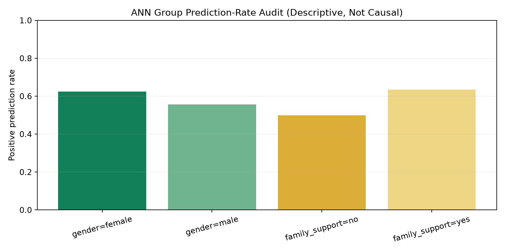

# CEIT Synthetic Project Experiment

## Status and purpose

This experiment uses **1,400 generated records** and must not be described as research on real Mandalay Technological University students. Its purpose is to demonstrate the CEIT software, ANN pipeline, baseline comparison, fairness screening, and reporting workflow when approved institutional data is unavailable.

The fixed generation seed is `20260831`. Each of the seven CEIT academic levels contains 200 records. The dataset contains 968 pass and 432 fail outcomes using a final-grade threshold of 50.

## Shared experimental split

| Split | Records |
|---|---:|
| Training | 896 |
| Validation | 224 |
| Held-out test | 280 |

## Model comparison

| Model | Accuracy | Precision | Recall | F1 | ROC AUC |
|---|---:|---:|---:|---:|---:|
| ANN (64–32) | 0.771 | **0.892** | 0.763 | 0.822 | 0.880 |
| Logistic Regression | 0.771 | **0.892** | 0.763 | 0.822 | **0.880** |
| Random Forest | **0.793** | 0.874 | **0.820** | **0.846** | 0.868 |

Random Forest has the highest F1 score on this fixed synthetic split. The separately trained operational ANN has accuracy 0.761, precision 0.890, recall 0.747, and F1 0.812; its 0.761 accuracy exceeds the 0.693 majority-class baseline.

## Descriptive bias screening

For the benchmark ANN, the gender accuracy gap is 0.028 and recall gap is 0.014. The family-support accuracy gap is 0.056 and recall gap is 0.085. These differences come from designed synthetic relationships and sampling variation. They neither prove fairness nor represent real CEIT groups.

## Limitations

- Generated correlations reflect documented design assumptions, not observed MTU behaviour.
- Gender is excluded from the grade equation, but it remains available solely to test group auditing.
- Family support and internet access influence generated learning behaviours, which can create indirect group differences.
- High model scores would only show that a model learned the generator; they would not establish real-world validity.
- Predictions must remain labelled as project demonstrations and must not be used for actual student decisions.
