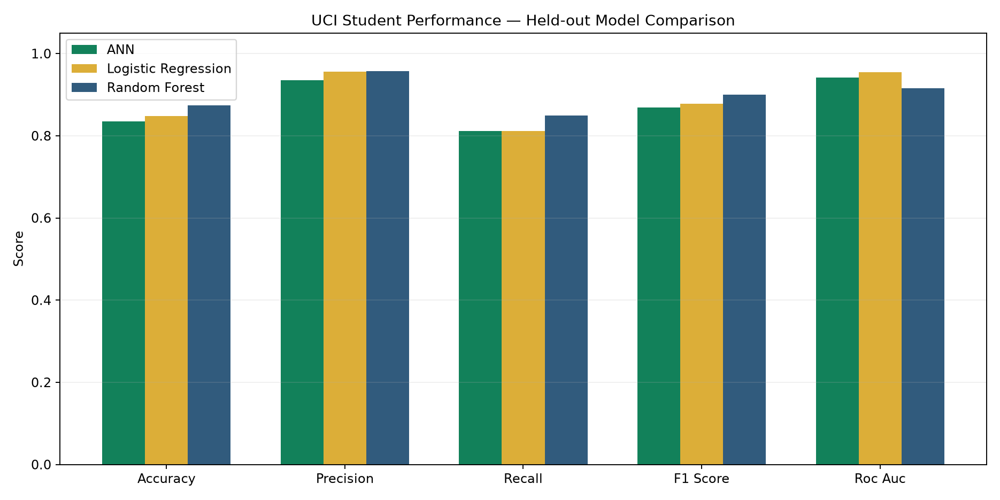
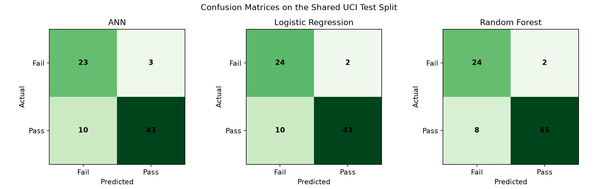
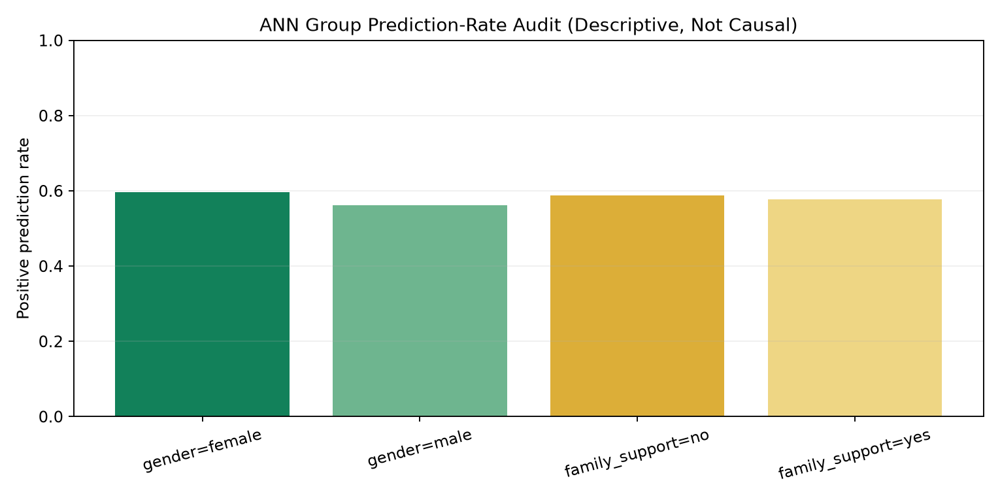

# CEIT Student Performance Prediction — UCI Benchmark Report

## 1. Project scope

This is a departmental pilot for the **Computer Engineering and Information Technology (CEIT)** department at Mandalay Technological University (MTU). Authorized CEIT teachers can manage pseudonymous student records, run early-support predictions, record interventions, and review model evidence.

The system supports seven academic levels across the six-year programme: First Year, Second Year, Third Year, Fourth Year, Fifth Year First Semester, Fifth Year Second Semester, and Final Year.

## 2. Dataset and experimental protocol

The official UCI Student Performance Mathematics dataset was used as the initial external benchmark. It contains 395 usable student records with final grade `G3` on a 0–20 scale. A grade of 10 or above was treated as pass.

| Split | Records |
|---|---:|
| Training | 252 |
| Validation | 64 |
| Held-out test | 79 |
| Total | 395 |

The split was stratified with fixed random seed 42. Every model used the same held-out test records and a preprocessor fitted only on training data. The available benchmark features were age, estimated attendance, study time, previous grade (`G2`), absences, participation, gender, internet access, and family support. UCI does not contain homework completion, so it was explicitly excluded.

## 3. Model comparison

| Model | Accuracy | Precision | Recall | F1 | ROC AUC |
|---|---:|---:|---:|---:|---:|
| ANN (64–32) | 0.835 | 0.935 | 0.811 | 0.869 | 0.941 |
| Logistic Regression | 0.848 | 0.956 | 0.811 | 0.878 | **0.955** |
| Random Forest | **0.873** | **0.957** | **0.849** | **0.900** | 0.916 |

Random Forest produced the strongest held-out F1 score. The requested ANN performed well but did not outperform both conventional baselines. This comparison is important: model selection should follow evidence rather than assuming a neural network must be superior.





## 4. Bias screening

Gender and family-support groups were screened separately for accuracy, positive-prediction rate, recall, false-positive rate, and false-negative rate. The table below shows the maximum absolute gap between groups for the ANN.

| Sensitive feature | Accuracy gap | Positive prediction-rate gap | Recall gap | False-positive-rate gap | False-negative-rate gap |
|---|---:|---:|---:|---:|---:|
| Gender | 0.014 | 0.033 | 0.051 | 0.176 | 0.051 |
| Family support | 0.021 | 0.010 | 0.083 | 0.167 | 0.083 |



These are descriptive warning indicators from small test groups. They are not proof of discrimination, fairness, or causation. In particular, the false-positive-rate gaps require further review with repeated validation, confidence intervals, and approved MTU data before institutional use.

## 5. Discussion and limitations

- The UCI records describe Portuguese secondary-school students, not CEIT university students in Myanmar.
- UCI attendance is estimated from absences; homework completion is unavailable.
- `G2` is close in time to final grade `G3`, so it can make performance appear stronger than an earlier-semester warning system.
- One 79-record test split is not enough to claim general performance or fairness.
- Gender and family support must never be used to punish, grade, rank, or deny an opportunity.
- Predictions are support signals for teacher review, not automated academic decisions.

## 6. MTU CEIT validation status

**Status: awaiting an approved, anonymized MTU CEIT dataset.** No result in this report is presented as validated MTU performance.

When permission and data are available, validation should be performed by academic level and semester, with student codes instead of names. The data should be split by student and, where possible, by academic period to avoid leakage. ANN, Logistic Regression, and Random Forest must be rerun under the same protocol. Group sample sizes, confidence intervals, calibration, false-negative rates, and potential drift should be reported before any operational rollout.

## 7. Reproducibility

```bash
python scripts/download_uci.py
python -m student_performance.experiment \
  --data data/uci/student-mat.csv \
  --dataset-name "UCI Student Performance — Mathematics" \
  --pass-threshold 10 \
  --output artifacts/experiments/uci
```

For an approved MTU export, keep the original file access-controlled and run the same pipeline into a separate output directory. Do not overwrite the UCI benchmark artifacts.

## 8. Source

P. Cortez, A. Silva, *Using Data Mining to Predict Secondary School Student Performance*, 2008. UCI Machine Learning Repository, Student Performance dataset, DOI: <https://doi.org/10.24432/C5TG7T>.
